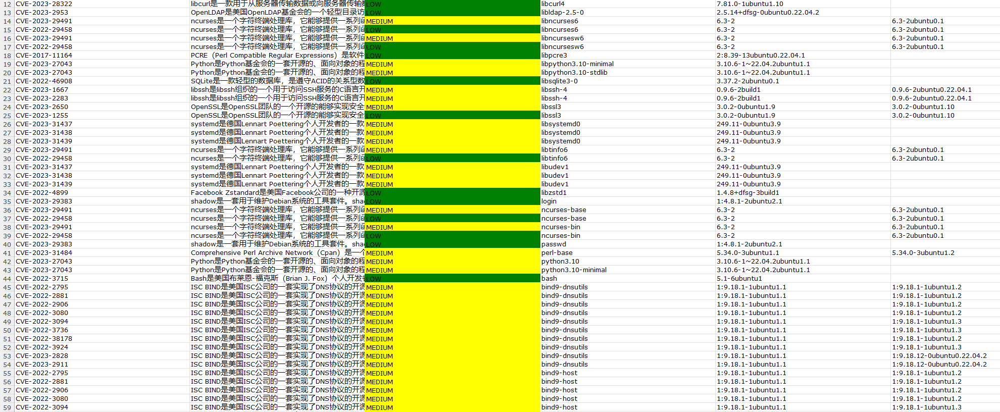
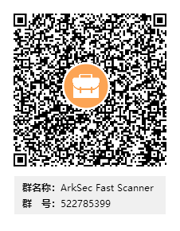

# Fast Scanner

简体中文 | [English](README-en-us.md)

容器镜像可能包含过时的软件版本、未修复的漏洞、敏感信息泄露等安全隐患。这些隐患可能被攻击者利用，导致容器被入侵、数据泄露或者被用于发起恶意攻击。因此，定期的镜像安全扫描和更新是非常必要的。

Fast Scanner 是一款专为容器场景（如Docker和Containerd）设计的镜像扫描器，能够扫服务器上容器应用的镜像。它提供两种工作模式：节点镜像扫描和仓库镜像扫描。一旦扫描完成，Fast Scanner 能生成 XLSX 格式的详细报告。

该工具充分考虑了国产化需求，能够扫描基于欧拉、麒麟、统信基础镜像构建的容器镜像，展现出强大的兼容性和适用性。

# 快速开始

```bash
docker run --rm -it --privileged \
  -e RUNTIME=docker \
  -v /var/run/docker.sock:/var/run/docker.sock \
  -v $(pwd)/reports:/app/reports \
  docker.io/arksec/fast-scanner:v1.0.0
```

或者，使用位于阿里云的 fast-scanner 镜像

```bash
docker run --rm -it --privileged \
  -e RUNTIME=docker \
  -v /var/run/docker.sock:/var/run/docker.sock \
  -v $(pwd)/reports:/app/reports \
  registry.cn-beijing.aliyuncs.com/arksecurity/fast-scanner:v1.0.0
```

<!-- OR

```bash
curl https://raw.githubusercontent.com/arkseclabs/fast-scanner/main/scripts/scan.sh | bash
``` -->

# Fast Scanner 的亮点

* **国产化支持程度较高：** 支持麒麟、统信、欧拉等国产操作系统，可以扫描基于此类操作系统构建的容器镜像

* **一键扫描出报告：** 支持运行一次性容器，快速对服务器进行安全扫描，快速出具容器镜像的扫描安全报告

* **多种镜像仓库支持：** 支持主流的 Docker Registry、Harbor、JFrog、ACR、SWR。同时私有云场景支持也很好，华为阿里的私有云、博云、灵雀、秒云、KubeSphere 以及更多

# 运行 Fast Scanner

## 节点镜像扫描

节点镜像是下载到本地容器运行环境（即节点）上并可能被使用来运行容器的镜像。这些镜像存储在容器运行环境的本地镜像库中，可以直接被用来创建和运行容器。

在 Docker 环境中，你需要将 docker.sock 文件挂载到扫描容器中。默认情况下，docker.sock 文件位于 /var/run/docker.sock 路径下。

```bash
docker run --rm -it --privileged \
  -e RUNTIME=docker \
  -v <path_to_docker_socket>:/var/run/docker.sock \
  -v $(pwd)/reports:/app/reports \
  docker.io/arksec/fast-scanner:v1.0.0
```

如果你正在使用 containerd 作为容器运行时，你需要把 containerd 的 socket 挂载到扫描器容器内，其中 socket 的默认路径是 `/run/containerd/containerd.sock`。然后，利用 `ctr` 工具创建 containerd 场景的扫描容器。

```bash
ctr images pull docker.io/arksec/fast-scanner:v1.0.0
ctr run --rm -t \
  --env RUNTIME=containerd \
  --mount type=bind,src=<path_to_containerd_socket>,dst=/run/containerd/containerd.sock,options=rbind:rw \
  --mount type=bind,src=$(pwd)/reports,dst=/app/reports,options=rbind:rw \
  docker.io/arksec/fast-scanner:v1.0.0 fast-scanner-container

```

## 仓库镜像扫描

仓库镜像是指存储在远程镜像仓库（例如Docker Hub或私有仓库）中的镜像。这些镜像通常用来分享和分发，当需要在新的节点上运行容器时，可以从仓库下载这些镜像到本地作为节点镜像。在开发和部署流程中，开发者通常会将构建好的镜像推送到仓库，然后在需要运行容器的节点上从仓库拉取镜像。

1. 配置身份凭证

为确保 Fast Scanner 能顺利访问远程镜像仓库，您需要配置相应的登录凭证。假如您的镜像仓库采用常规的用户名和密码进行身份验证，请按照以下步骤进行配置。以下示例展示如何配置使用 Token 方式进行 Harbor 登录的凭证。

```yaml
# @.harbor.enabled 启用该登录凭证
# @.harbor.config.insecure 远程镜像仓库的 TLS 合法性，如果是不安全的镜像仓库，需要修改此值为 true
# @.harbor.config.address 远程镜像仓库的 URL
# @.harbor.config.username 用户
# @.harbor.config.password 密码
harbor:
  enabled: true
  config:
    insecure: false
    address: "https://registry.arksec.cn"
    username: "admin"
    password: "123456"
```

2. 将身份凭证配置文件挂载至容器并运行

```bash
docker run --rm -it --privileged \
  -e RUNTIME=docker \
  -v /var/run/docker.sock:/var/run/docker.sock \
  -v $(pwd)/config-example.yaml:/app/config/config.yaml \
  -v $(pwd)/reports:/app/reports \
  docker.io/arksec/fast-scanner:v1.0.0
```

## 获取扫描报告

镜像扫描后的报告会被存放在您当前工作目录的 `reports` 文件夹内，其报告名以 `reports_*` 的形式命名。为了方便查阅，您可以使用如SCP、SecureCRT、Xshell、WinSCP 或者 MobaXterm 等工具将报告文件下载到本地电脑中。



# 兼容程度

**镜像系统版本支持列表**

- CentOS 3.x - 8.x

- RedHat 4.x - 8.x

- Debian 1.1.x - 12.x

- Ubuntu 4.10.x - 21.10.x

- EulerOS

- TencentOS

- RHCOS


**镜像仓库品牌支持列表**

- Docker Registry 2

- Harbor v1 & v2

**容器引擎支持列表**

- docker

- containerd

# 访问 DockerHub 网络受限？获取完整的镜像列表

我们在公共镜像仓库中提供了众多区域分布的镜像。根据您的地理位置，您可以选择最近或最适合的仓库进行镜像拉取。

```
docker.io/arksec/fast-scanner:v1.0.0
registry.cn-beijing.aliyuncs.com/arksecurity/fast-scanner:v1.0.0
registry.cn-shanghai.aliyuncs.com/arksecurity/fast-scanner:v1.0.0
registry.cn-hangzhou.aliyuncs.com/arksecurity/fast-scanner:v1.0.0
registry.cn-huhehaote.aliyuncs.com/arksecurity/fast-scanner:v1.0.0
registry.ap-northeast-1.aliyuncs.com/arksecurity/fast-scanner:v1.0.0    // 日本东京
registry.us-west-1.aliyuncs.com/arksecurity/fast-scanner:v1.0.0    // 美国硅谷
registry.me-east-1.aliyuncs.com/arksecurity/fast-scanner:v1.0.0    // 阿联酋迪拜
```

# 技术交流群

我们是一群热衷于技术研发的极客、营销专家和发烧友，对未来充满无限创意、梦想和激情。“进无止境” 是我们所倡导的品牌文化，号召属于这个时代的人，勇于创新，敢于创造！

**QQ 群**

<p float="left">
  
</p>

# 关于公司

雅客云（ArkSec）是一家专注云原生安全领域，从云端到边缘，持续探索、研发革命性技术，致力于突破产业变革的高科技公司。雅客云诞生于云原生技术架构和设计思想对安全带来巨大变革前际，公司总部位于首都北京。

我们团队的核心成员来自海内外知名领先的信息安全、基础架构公司，共同打造了基于云原生技术架构和设计理念的云原生安全全栈产品和服务为主的技术驱动型高新技术企业。

    https://www.arksec.cn

    https://www.arksec.cn/blog/

**公众号**

<p float="left">
  
</p>

# LICENSE

Copyright (c) 2020-2023 ArkSec

Licensed under the Apache License, Version 2.0 (the "License");
you may not use this file except in compliance with the License.
You may obtain a copy of the License at

    https://www.apache.org/licenses/LICENSE-2.0
